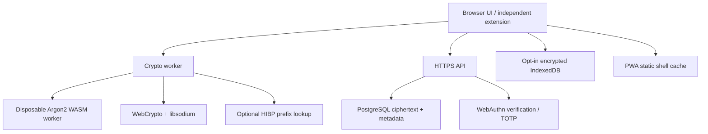
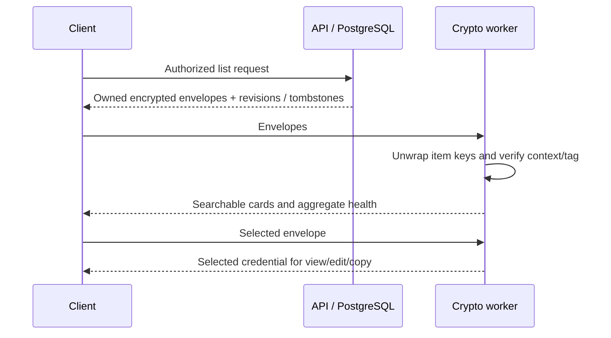

# Architecture and data flow

## Components



Only the UI/crypto worker sees unlocked credential values. A selected record is decrypted for its view/editor; the worker returns secret-free list/health summaries. The master is transferred as a mutable byte buffer to a disposable Argon2 worker through the crypto worker. Transfer detaches the originating copy; controlled buffers and WASM heap are wiped and the KDF worker is terminated. On lock, the persistent crypto worker is terminated and secret views are unmounted. Native keys are nonextractable except during initial creation/wrapping, local password rewrapping or deliberate sharing-key transfer.

## Registration

```mermaid
sequenceDiagram
  participant UI as Browser
  participant AU as Authenticator
  participant CW as Crypto worker
  participant API as API / PostgreSQL
  UI->>API: Email + operator invitation
  API-->>UI: Registration challenge + UUIDs
  UI->>AU: Create discoverable user-verified passkey
  AU-->>UI: Public credential response
  UI->>CW: Master bytes + vault UUID
  CW->>CW: Argon2id, HKDF, random vault / identity keys
  CW-->>UI: Wrapped vault key + encrypted identity + public key
  UI->>API: WebAuthn response + encrypted profile
  API->>API: Verify origin, RP, challenge, UV; admit at most 50 users
  API-->>UI: HttpOnly session + CSRF token
```

The invitation is an operator credential controlling account creation, not a vault password. Registration uses a five-minute single-use challenge; accounts and initial passkeys/session are committed transactionally. The master never participates in a server login verifier.

## Login and local unlock

```mermaid
sequenceDiagram
  participant UI as Client
  participant AU as Authenticator
  participant API as API / PostgreSQL
  participant CW as Crypto worker
  UI->>API: Request discoverable challenge
  API-->>UI: Challenge, RP ID, UV required
  UI->>AU: Sign origin-bound challenge
  AU-->>UI: Assertion
  UI->>API: Assertion, then TOTP or recovery code if enabled
  API->>API: Consume challenge; verify signature/counter; rate/backoff
  API-->>UI: Session + encrypted profile
  UI->>CW: Profile + master bytes
  CW->>CW: Argon2id + HKDF; unwrap vault key; verify identity GCM
  CW-->>UI: Unlock result only
```

A public username lookup is not required for login. Sessions last at most twelve hours and have a thirty-minute server-idle timeout. Sensitive settings require authentication within five minutes. Client auto-lock is separate: five minutes by default, configurable to 1/2/5/10/15/30 minutes, and immediate when the tab is hidden. TOTP counters reject reuse across the ±1 accepted time-step window; recovery codes are atomically consumed after an already verified passkey.

## Save an item

```mermaid
sequenceDiagram
  participant UI as Editor
  participant CW as Crypto worker
  participant API as API
  participant DB as PostgreSQL
  UI->>CW: Item + previous envelope + next revision
  CW->>CW: Retain last 5 password versions; fresh item key + IV
  CW->>CW: AES-GCM payload + AES-KW wrapped item key
  CW-->>UI: Versioned encrypted envelope
  UI->>API: Envelope + expected server revision
  API->>DB: Owner check, row lock, revision comparison, encrypted write
  DB-->>API: New revision or conflict
  API-->>UI: Result; never decrypted fields
```

Offline writes take the same crypto path, then persist only encrypted envelopes plus expected base revisions. Further offline edits replace the queued envelope while retaining its original base revision and generating a new key/IV. Synchronization submits those changes individually. Conflicts stop rather than merge secrets automatically. Deletion creates a server tombstone and revokes server-hosted shares; old recipient copies/backups remain possible.

## Retrieve an item



## Extension and PWA boundaries

The extension contains an independently built popup, crypto bundle, worker and WASM. A fresh web account session creates a five-minute single-use pairing grant; the extension exchanges it for a device bearer token. This token expires/idle-times out like other sessions, cannot change account security settings, and is kept only in extension `storage.session`. The extension asks permission for its selected backend host, not every visited website. `activeTab` allows a user-clicked, exact-origin top-frame autofill; the page is rechecked inside the injected function to close navigation races. No remote script, background polling, automatic filling or submission is used.

The PWA service worker precaches only an explicit list of generated application assets. It never intercepts `/api` for caching, never puts vault values in CacheStorage, and never provides a plaintext vault fallback. Ciphertext in IndexedDB is opt-in and remains decryptable offline with the master. The web app cannot detect malicious replacement of its own trusted origin or globally prevent rollback of previously valid encrypted records.
